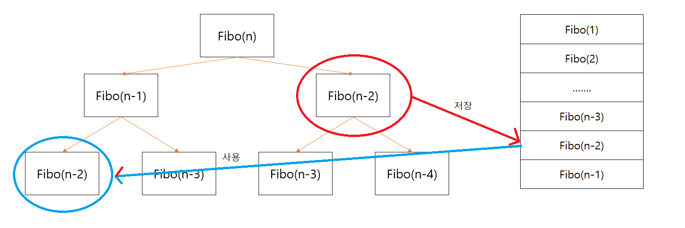

## 1. 완전 탐색 

</img>

피보나치 함수는 위 그림처럼 재귀적으로 구성할 수 있습니다. 

Fibo(n)  

=> Fibo(n-1) + Fibo(n-2)

=> Fibo(n-2) + Fibo(n-3) + Fibo(n-3) + Fibo(n-4)

이처럼 모든 경우를 탐색하는 방법을 완전 탐색이라고 부릅니다.

## 2. Dynamic Programming

</img>

DP는 위처럼 완전탐색에서의 반복되는 부분문제의 계산결과를 저장하여 한번만 푸는 방식입니다.

반복적인 작업을 줄이기에 수행시간은 짧아지지만, 결과를 저장해 놓을 추가적인 공간이 필요합니다.

위 경우 피보나치 함수는 함수의 입력값 n에 의해 출력값이 유일하게 결정됩니다. 

약 n개의 결과값을 저장할 공간만 있으면 충분하고, DP를 적용할 수 있습니다.

이처럼 특정 status에서 함수의 출력값이 유일하게 결정된다면,

이 status를 토대로 저장할 공간을 만들고 DP를 적용할 수 있습니다.

status의 범위를 너무 세세하게 잡을 경우 저장공간이 부족하거나 겹치는 부분문제가 너무 적어지는 문제가 발생할 수 있고,

status의 범위를 너무 광범위하게 잡으면 같은 status인 경우에도 출력값이 유일하게 결정되지 않을 수 있습니다.

